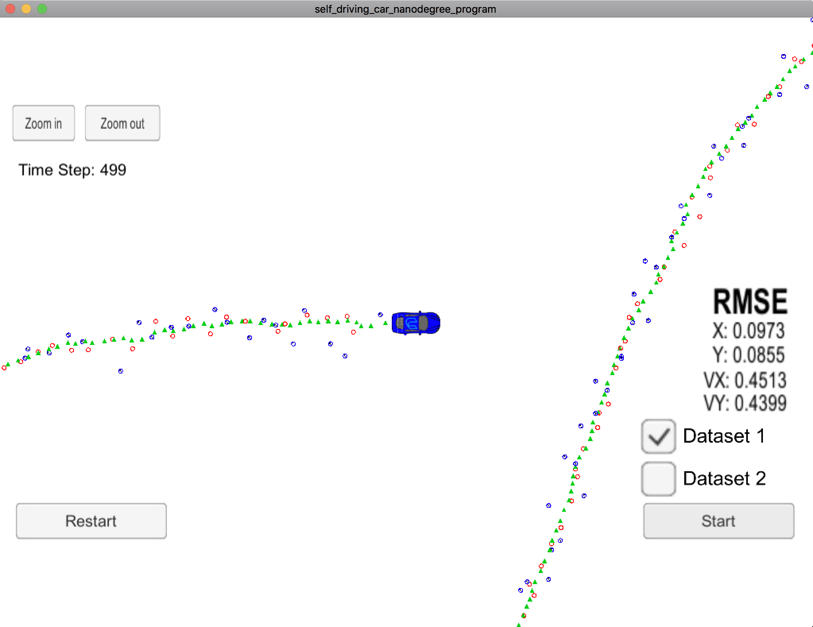

# Term2 - Project 1 : Extended Kalman Filter Project

Self-Driving Car Engineer Nanodegree Program

Project 1 - Extended Kalman Filter


# Project Rubric

### Compiling

After cloning this repo.

```
1. mkdir build
2. cd build
3. cmake ..
4. make
5. ./ExtendedKF
```

### Accuracy

The final result was as shown below.

[ px, py, vx, vy ] = [ 0.0973, 0.0855, 0.4513, 0.4399 ]




